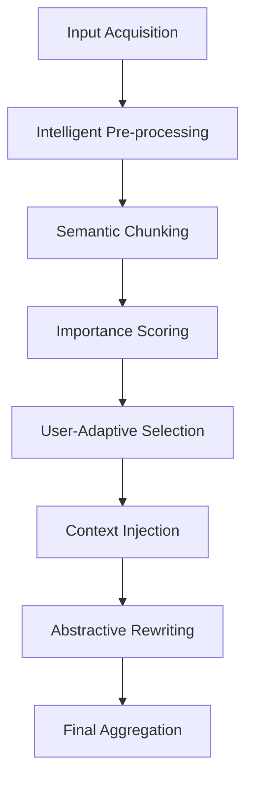

# 🧠 UAMSA: User-Aware Multimodal Summarization Algorithm

This document details the custom **8-Step Architecture** designed for the Smart AI Video Summarizer.

Unlike standard wrappers that simply pass text to an API, UAMSA implements a **Hybrid Pipeline** combining **Extractive Heuristics (Math)** with **Abstractive Generative AI (Deep Learning)**.

---

## 🚀 The 8-Step Pipeline

### 1. Input Acquisition & Validation

**Goal**: Ensure quality data ingestion.

- **Process**: System accepts raw text, PDF content, or Video transcripts.
- **Validation**: Filters out empty inputs, very short texts (<50 words), or corrupted binary data.
- **Fail-Safe**: If input is massive (>100k words), it flags for batch processing.

### 2. Intelligent Pre-processing

**Goal**: Reduce noise to improve AI focus.

- **Logic**:
  - **Normalization**: content is lowercased (for scoring) but case-preserved (for rewriting).
  - **Noise Removal**: Regex filters strip excessive whitespace, non-standard unicode characters, and broken encoding artifacts.
  - **Sentence Boundary Detection**: Uses `NLTK` (Natural Language Toolkit) to identify true sentence endings (distinguishing "Dr." from end of sentence).

### 3. Semantic Chunking

**Goal**: Divide content into manageable, logical units.

- **The Problem**: Transformer models (like T5/BART) have a token limit (e.g., 512-1024 tokens).
- **The Solution (Dynamic Windowing)**:
  - Instead of hard-cutting at word 500, we use a **Sliding Window**.
  - We accumulate sentences until ~400 words.
  - **Result**: Context is preserved; sentences are never cut in half.

### 4. Importance Scoring (The Core "Brain")

**Goal**: Mathematically identify the "Best" parts of the text.

- **Method**: Each chunk is assigned a score ($S$) from $0.0$ to $1.0$.
- **The Formula**:
  $$ S\_{chunk} = (\alpha \cdot \text{TF-IDF}) + (\beta \cdot \text{Position}) + (\gamma \cdot \text{Length}) $$
  - **TF-IDF (Keyword Density)**: Calculates how "unique" and "rich" the vocabulary is in that chunk compared to the rest.
  - **Position Bias**: Gives higher weight to the **Introduction** (Thesis) and **Conclusion** (Summary).
  - **Length Penalty**: penalizes very short fragments that lack substance.

### 5. User-Adaptive Ranking & Selection (Extractive Phase)

**Goal**: Filter content based on user constraints.

- **Input**: User selects "Short", "Medium", or "Long".
- **Logic**:
  - **Short**: Select Top 30% highest-scoring chunks (Aggressive filtering).
  - **Medium**: Select Top 50%.
  - **Long**: Select Top 70% (Detailed).
- **Re-Ordering**: After selection, chunks are **re-sorted** by their original index to maintain the narrative flow/chronology.

### 6. Context Injection

**Goal**: Prepare text for the specific AI Model architecture.

- **Action**: Prefixes the text with task-specific control tokens.
- **For T5 Model**: Appends `summarize: ` to the start of each text block.
- **Why?**: This triggers the model's "Rewriting" mode rather than its "Translation" or "Classification" modes.

### 7. Abstractive Rewriting (The "Generative" Phase)

**Goal**: Rewrite the robotic/extracted text into human-like language.

- **Model**: `T5-Base` (Text-To-Text Transfer Transformer).
- **Mechanism**:
  - **Nucleus Sampling (`top_p=0.95`)**: Instead of picking the most probable word (which is boring), it samples from the top 95% probability mass, allowing for creative word choices.
  - **Repetition Penalty**: Strictly forbids repeating any 3-word phrase (`no_repeat_ngram_size=3`).
  - **Temperature (0.7)**: Adds a "creativity" factor to the generation.
- **Result**: The sentence "ML is a field of study..." might become "Machine Learning is a key branch of AI analyzing data patterns."

### 8. Aggregation & Output Generation

**Goal**: Stitch the pieces into a cohesive final story.

- **Process**:
  - Takes the independent rewritten chunks.
  - Joins them with natural spacing.
  - Performs a final capital letter check.
- **Output**: Returns the final abstractive summary to the frontend.

---

## 🛠 Libraries Used

- **NLTK**: For sentence tokenization and data management (`punkt_tab`).
- **Scikit-Learn**: For TF-IDF vectorization and matrix calculations.
- **HuggingFace Transformers**: For the `T5-Base` model and Tokenizer pipeline.
- **PyTorch**: The underlying tensor computation engine.
- **NumPy**: For efficient array math during scoring.
